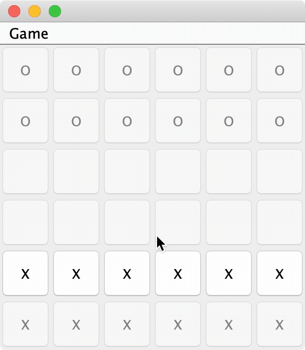

# Breakthrough

The Breakthrough game implemented in Java. This is a project work for university.

Read more about the Breakthrough on [Wikipedia](https://en.wikipedia.org/wiki/Breakthrough_(board_game)).



## Running the app

In order to run the app, run the following commands **FROM THE `src`** directory:

```
javac breakthrough/*.java
java breakthrough/Main
```
## Ceaning the project

To get rid of the `.class` files run the following commands from the `src` directory:

```
rm breakthrough/*.class breakthrough/*/*.class
```

The project uses MIT License.
